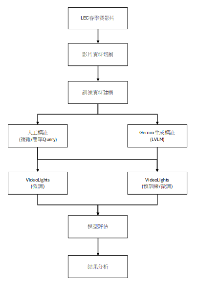
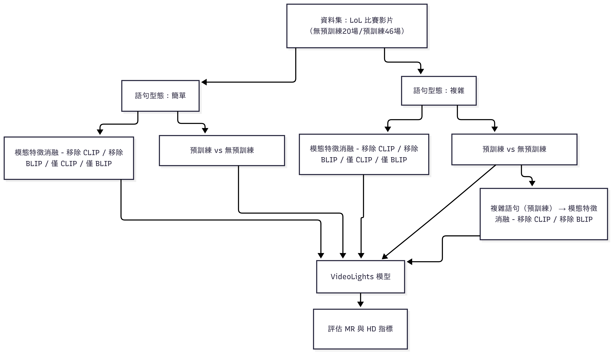

# 結合大型視覺語言模型與多模態檢索技術於電競賽事影片精華偵測之研究：以《英雄聯盟》為例
**An Applied Study on Esports Highlight Detection in Match Videos Using Large Vision-Language Models and Multimodal Retrieval Techniques: A Case Study of League of Legends**

> **Author**: 王聖維  
> **Advisor**: 謝文川 博士  
> **Affiliation**: 國立高雄科技大學 智慧商務系  
> **Year**: 2025  

## 🔗 相關連結
- [資料集與標註流程 Repository](https://github.com/victor-wang0125/lol-highlight-dataset)
- [程式碼與實驗框架 Repository](https://github.com/victor-wang0125/lol-highlight-codebase)

---

## 📖 研究背景
- 電子競技（Esports）已成為全球新興娛樂產業，觀眾越來越偏好觀看 **精華片段** 而非完整賽事。  
- 傳統精華製作高度仰賴人工，耗時且難以規模化。  
- 如何結合 **深度學習** 與 **大型視覺語言模型（LVLMs）**，自動偵測比賽中關鍵事件，是一項重要挑戰。  

---

## 🎯 研究目的
1. 檢驗 LVLM 生成的合成敘事資料，是否能支援弱監督訓練並降低標註成本。  
2. 探討多模態檢索技術於高結構語境（英雄聯盟比賽影片）的適應性與挑戰。  
3. 驗證不同語句型態、模態組合與弱監督策略對 HD/MR 任務的影響。  

---

## 📚 文獻探討
- **Moment Retrieval (MR)**：根據自然語言查詢，在影片中定位對應時間片段。  
- **Highlight Detection (HD)**：無查詢條件下，自動判斷影片中的「精華時刻」。  
- **資料標註方法**：人工標註（精準但成本高）、群眾標註（擴展快但品質不穩）、弱監督（低成本但語意可能不準）。  
- **多模態模型**：CLIP、BLIP、Gemini 等在跨模態對齊與敘事生成上具潛力。  

---

## 🔬 研究方法

- **資料來源**：2023 年 LEC 春季賽，共 46 場比賽影片。  
- **資料處理**：
  - 影片切割（10 秒／150 秒片段）。  
  - Gemini 生成弱監督敘事語句（簡單 query）、人工撰寫複雜 query。  
  - BLIP ITM 產生 saliency 分數。  
- **模型架構**：VideoLights  
  - FRA（特徵精煉對齊）  
  - Bi-CMF（跨模態融合）  
  - Uni-JFM（跨任務回饋）  
- **訓練策略**：  
  - 預訓練：LVLM 生成弱監督資料  
  - 微調：人工標註高語意片段  

---

## 📊 實驗與結果
- **語句型態**：  
  - 複雜敘事語句 → 在 MR 與 HD 任務中有助於提升語意對齊與精度。  
  - 簡單語句 → 在單模態設定下表現更穩定。  
- **弱監督預訓練**：  
  - 顯著提升高門檻指標（如 R1@0.7、mAP@0.75）。  
- **模態消融實驗**：  
  - 無預訓練：移除 CLIP 反而能提升 MR 整體表現。  
  - 有預訓練：BLIP 對 MR 任務具關鍵貢獻。  

---

## 🏆 研究貢獻
1. 建構並釋出電競專屬精華偵測資料設計流程。  
2. 首次針對《英雄聯盟》賽事影片，實證 HD/MR 模型應用成效。  
3. 驗證 LVLM 弱監督語料在高語境下的潛力與限制。  
4. 比較不同語句型態對跨模態檢索的實際影響。  
5. 指出現有多模態模型在高語意密集場景的挑戰與應用邊界。  

---

## 📄 結論與未來方向
- **結論**：  
  - 複雜語句在多模態設定下有優勢。  
  - LVLM 弱監督預訓練具實質效益。  
  - 模態組合需謹慎調整，並非線性疊加。  

- **未來研究**：  
  - 發展賽事語境感知的語句生成機制。  
  - 強化語境推理與跨片段事件建模能力。  
  - 優化模態組合策略，減少模態干擾。  

---

📎 論文全文請參見 `docs/` 資料夾。  

